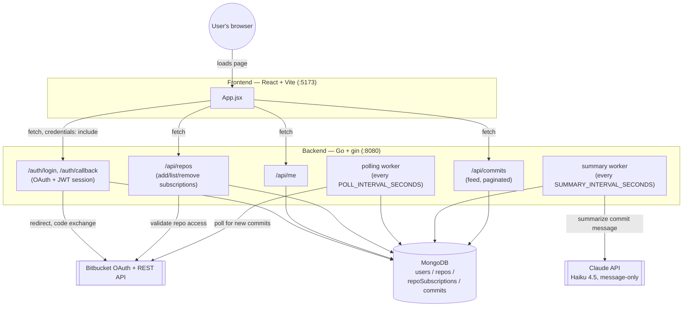
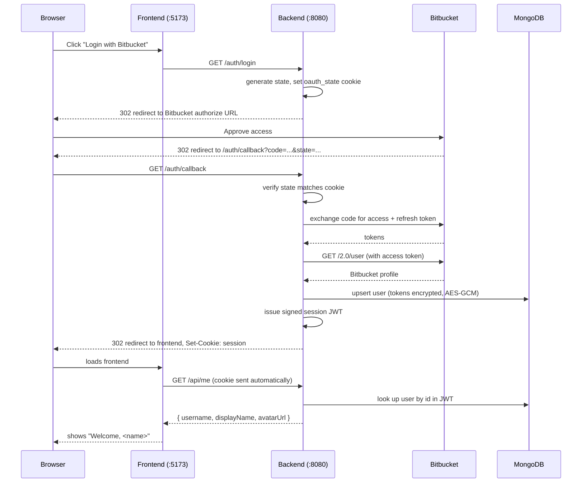
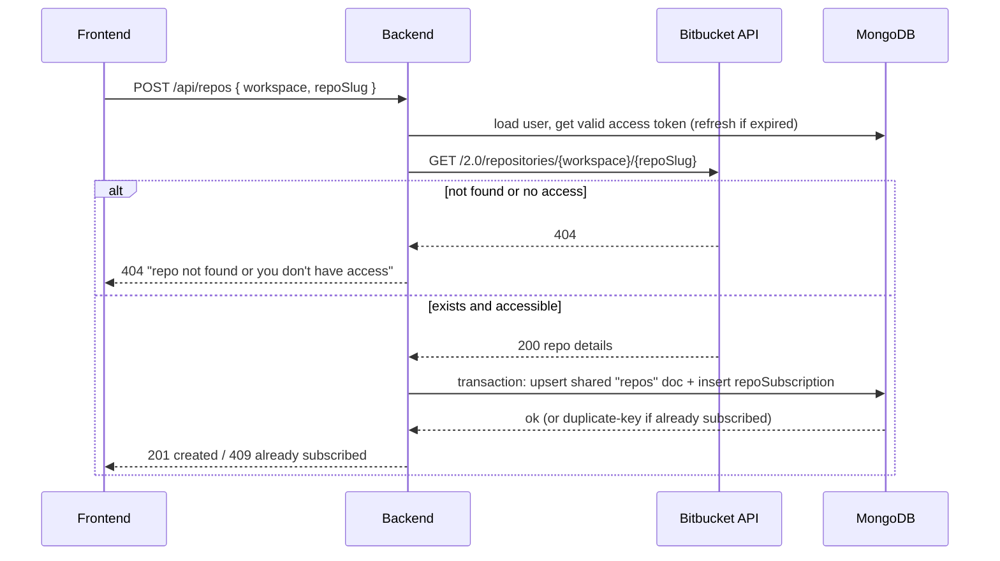
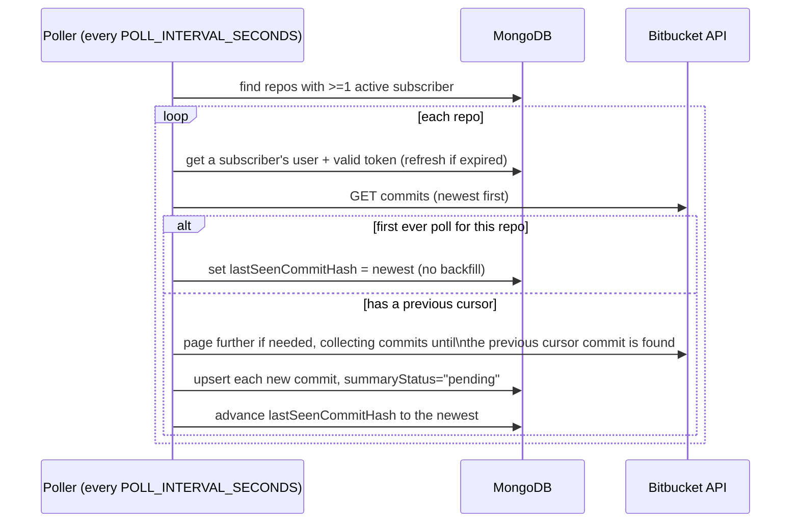
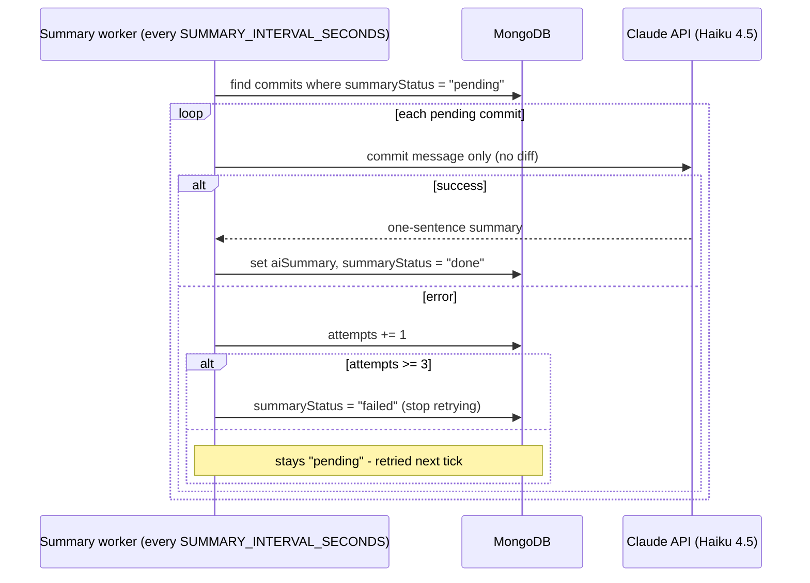
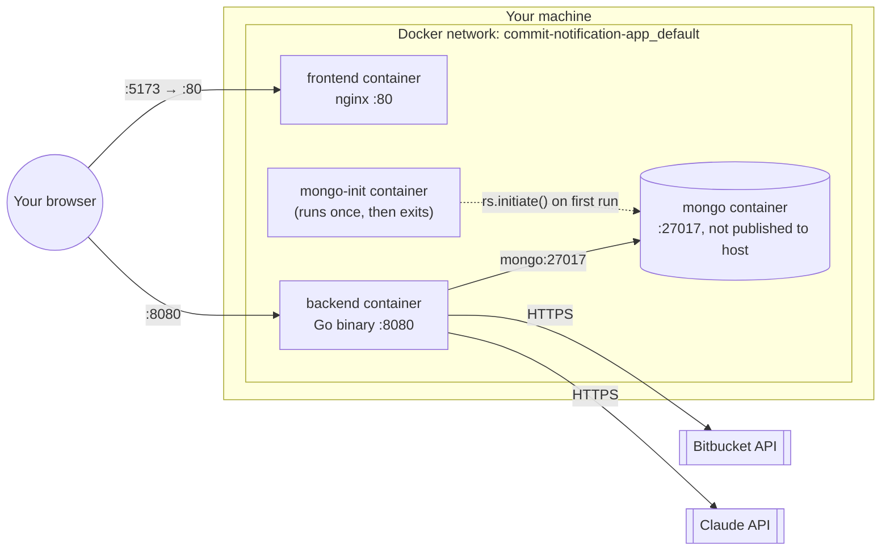

# Commit Notification App

A web app to log in with Bitbucket, subscribe to repositories, and see a feed of new
commits with AI-generated one-line summaries.

> **This README is kept up to date as the app is built.** The "What works today"
> section and the roadmap checklist reflect the current state, not the end goal.

---

## What works today

- ✅ **Bitbucket OAuth login** — click "Login with Bitbucket" on the frontend,
  approve access, and you're logged in. The backend exchanges the OAuth code,
  fetches your Bitbucket profile, stores it (with encrypted tokens) in MongoDB,
  and issues a session cookie.
- ✅ **Session check** — the frontend calls `/api/me` on load to know whether
  you're logged in, and shows your name/avatar if so.
- ✅ **Health/infra plumbing** — Go backend ↔ MongoDB (single-node replica set,
  via Docker) ↔ React/Vite frontend all run and talk to each other locally.
- ✅ **Manage Repos** — once logged in, add a repo by `workspace` + `repo-slug`;
  the backend validates it exists and you have access via the Bitbucket API
  before saving it, and you can list/remove your subscriptions.
- ✅ **Commit polling** — a background worker checks every actively-subscribed
  repo every `POLL_INTERVAL_SECONDS` (default 60s) for new commits and stores
  them. The first poll of a newly subscribed repo only records a baseline
  (no backfill of old history, per the earlier cost decision) - only commits
  from that point on get stored.
- ✅ **Claude summaries** — a second background worker picks up commits with
  `summaryStatus: "pending"` and asks Claude Haiku 4.5 for a one-sentence
  summary of the commit message (message only, no diff, per the cost
  decision). Failed calls retry up to 3 times before being marked `"failed"`.
  **Requires `ANTHROPIC_API_KEY` in `.env`** — without it, the backend logs a
  warning and skips this worker; commits just stay `"pending"` until it's set.
- ✅ **Commit Feed** — once logged in, see commits across all your subscribed
  repos in one feed: AI summary, which repo, author, timestamp, and a link to
  the commit on Bitbucket, newest first, with "Load more" pagination.
- ✅ **Real UI design pass** — the frontend has moved past the default Vite
  starter styling: a proper app header, card-based sections, status badges for
  pending/failed summaries, a real login screen, and light/dark theme support
  (follows the OS setting). No new dependencies — plain CSS with design tokens
  in `index.css`, components styled in `App.css`.
- ✅ **Logout** — clears the session cookie server-side (`POST /auth/logout`),
  with a "Log out" button in the header. Before this, restarting the backend
  was the only way to end a session.
- ✅ **Fully Dockerized** — `docker-compose.full.yml` runs the entire app
  (Mongo + backend + frontend) in containers with one command; no Go/Node/nvm
  install needed. See [Running it](#running-it-locally) below.

**All six planned build steps are done, plus logout and full Dockerization.**
What's left is further polish — see [Roadmap](#roadmap) and
[Possible Enhancements](#possible-enhancements) for ideas (webhooks instead of
polling, automated tests, etc.) — not core functionality.

---

## Architecture



### How login works today



### How adding a repo works today



### How commit polling works today



### How Claude summaries work today



### How the Commit Feed works today

```mermaid
sequenceDiagram
    participant FE as Frontend
    participant BE as Backend
    participant DB as MongoDB

    FE->>BE: GET /api/commits?limit=30&before=<cursor?>
    BE->>DB: find the user's repoSubscriptions -> repoIds
    BE->>DB: commits where repoId in repoIds (and committedAt < before),\nsorted newest-first, joined with repos for workspace/repoSlug
    DB-->>BE: page of commits
    BE-->>FE: { commits: [...], nextCursor }
    FE-->>FE: render feed; "Load more" re-fetches with before = nextCursor
```

---

## Tech stack

| Layer | Choice |
|---|---|
| Backend | Go, [gin](https://github.com/gin-gonic/gin), `golang.org/x/oauth2` |
| Database | MongoDB (`go.mongodb.org/mongo-driver/v2`), run as a single-node replica set (needed for later transactions) |
| Frontend | React (Vite), plain `fetch` — no state library |
| AI summaries | Claude API (Haiku 4.5), commit message only |
| Auth | Bitbucket OAuth2 → our own signed JWT session cookie |

---

## Requirements

**Option A (just run the app):** Docker only.

**Option B (development mode):**

| Tool | Version | Why |
|---|---|---|
| Docker | any recent | runs MongoDB |
| Go | 1.26+ | backend |
| Node.js | **≥22.12** in `frontend/` | Vite 8's bundler needs it — use `nvm use` (reads `frontend/.nvmrc`) |

---

## Running it locally

There are two ways to run this, depending on what you're doing.

### Option A — Just run the app (recommended if you're not changing code)

One command, no Go/Node/nvm install needed — everything (Mongo, backend,
frontend) runs in containers:

```bash
cd commit-notification-app
cp backend/.env.example backend/.env   # fill in real values - see Environment variables below
docker compose -f docker-compose.full.yml up -d --build
```

Open `http://localhost:5173` and log in with Bitbucket.

**Stopping:** `docker compose -f docker-compose.full.yml down` (add `-v` only
if you intend to wipe stored data).

### Option B — Development mode (editing backend/frontend code)

Only MongoDB runs in Docker; the backend and frontend run directly on your
machine so code changes take effect immediately (no image rebuild):

```bash
# 1. Database
cd commit-notification-app
docker compose up -d          # starts MongoDB as a single-node replica set

# 2. Backend (new terminal)
cd commit-notification-app/backend
go run ./cmd/server            # http://localhost:8080

# 3. Frontend (new terminal)
cd commit-notification-app/frontend
nvm use                        # picks up Node 22.12.0 from .nvmrc
npm run dev                    # http://localhost:5173
```

Open `http://localhost:5173` and log in with Bitbucket.

**Stopping:** `Ctrl+C` the backend/frontend; `docker compose down` for Mongo
(add `-v` only if you intend to wipe stored data).

**Why two separate compose files, not one?** MongoDB's replica set has to know
its own member address, and that address is different depending on who's
connecting: containers reach Mongo as `mongo` (Docker's internal DNS), but a
backend running directly on your machine needs `localhost`. The two modes
each initialize the replica set with the address that mode needs, so they use
separate containers/volumes rather than one trying to serve both.

---

## Docker in detail

What actually gets built and how the containers fit together, for Option A
(`docker-compose.full.yml`).



**`backend/Dockerfile`** — two stages: `golang:1.26-alpine` compiles a static
binary (`CGO_ENABLED=0`), then a bare `alpine:3.20` image just runs that
binary. No Go toolchain, source code, or build cache ships in the final
image — just the compiled server plus CA certificates (needed for the
outbound HTTPS calls to Bitbucket and Claude).

**`frontend/Dockerfile`** — two stages: `node:22-alpine` runs `npm ci` +
`npm run build` to produce the static `dist/` bundle (with `VITE_API_BASE_URL`
baked in as a build arg), then `nginx:alpine` serves that static output.
No Node, npm, or `node_modules` ships in the final image.

**`docker-compose.full.yml`** wires four containers together with an explicit
startup order (`depends_on` + healthchecks), so `up -d --build` alone gets
everything into a working state without a manual wait-and-retry:
1. `mongo` starts, healthcheck waits until it responds to pings.
2. `mongo-init` runs once (`rs.initiate(...)`) and exits successfully.
3. `backend` starts only after `mongo-init` has completed - connects using
   `mongo:27017` (Docker's internal DNS resolves the service name `mongo` to
   that container's address; nothing outside this Docker network can reach
   it, which is why the compose file doesn't publish Mongo's port to the host
   in this mode).
4. `frontend` starts, serving the pre-built static bundle - it doesn't call
   the backend itself, so it isn't blocked on anything; the *browser* is what
   calls the backend, directly, using the `VITE_API_BASE_URL` baked in at
   build time.

**Useful commands:**

```bash
# View logs (add -f to follow)
docker compose -f docker-compose.full.yml logs backend
docker compose -f docker-compose.full.yml logs frontend

# Rebuild after changing code (images aren't rebuilt automatically)
docker compose -f docker-compose.full.yml up -d --build

# Get a shell in a running container (for poking at things)
docker exec -it cna-full-backend sh

# Full teardown, including the Mongo data volume
docker compose -f docker-compose.full.yml down -v
```

**Data persistence:** Mongo's data lives in the named volume
`cna-full-mongo-data`, separate from the dev-mode volume used by
`docker-compose.yml` - the two modes never share data (see "Why two separate
compose files" above). A plain `down` (no `-v`) keeps the volume, so
`up -d --build` again picks up right where you left off.

---

## Environment variables (`backend/.env`)

See `backend/.env.example` for the full template. Required for OAuth login to work:

| Variable | What it is |
|---|---|
| `BITBUCKET_CLIENT_ID` / `BITBUCKET_CLIENT_SECRET` | From your Bitbucket OAuth consumer (workspace Settings → OAuth consumers) |
| `BITBUCKET_CALLBACK_URL` | Must exactly match the consumer's registered Callback URL (scheme/host/port/path/trailing-slash all matter) |
| `JWT_SECRET` | Random string used to derive the key that encrypts stored Bitbucket tokens at rest. **Not** used to sign session cookies (see note below). |
| `MONGO_URI` / `MONGO_DB` | Defaults work for the local Docker setup |
| `ANTHROPIC_API_KEY` | From the [Anthropic Console](https://console.anthropic.com/). Required for commit summaries — without it, commits stay `"pending"` forever. |
| `CLAUDE_MODEL` | Defaults to `claude-haiku-4-5` — cheapest tier, plenty for a one-sentence summary |
| `POLL_INTERVAL_SECONDS` | How often the commit-polling worker checks each subscribed repo (default `60`) |
| `SUMMARY_INTERVAL_SECONDS` | How often the Claude summary worker checks for pending commits (default `15`) |

**Frontend build-time variable (not in `.env`):** `VITE_API_BASE_URL` — where the
browser should reach the backend. Baked into the JS bundle at build time
(Vite convention), so it's passed as a Docker build arg (see
`docker-compose.full.yml`) rather than read at runtime. Defaults to
`http://localhost:8080` for local `npm run dev`.

`.env` holds real secrets and should never be committed; `.env.example` is the
safe-to-commit template.

> **Session behavior:** session cookies are signed with a random secret
> generated fresh every time the backend starts, not with `JWT_SECRET`. That
> means **restarting the backend logs everyone out**, on top of the explicit
> "Log out" button now in the header. Within one backend run, a login stays
> valid normally (24h, survives frontend restarts / page refreshes). This was
> originally a stand-in for not having a logout button at all; now that
> logout exists, keeping restart-forces-relogout on top of it is a judgment
> call worth revisiting for multi-user use — see
> [Possible Enhancements](#possible-enhancements).

---

## Project structure

```
commit-notification-app/
├── docker-compose.yml       — MongoDB only, for development mode (Option B)
├── docker-compose.full.yml — whole app in containers, for just running it (Option A)
├── backend/
│   ├── Dockerfile
│   ├── cmd/server/          — entrypoint
│   └── internal/
│       ├── auth/            — OAuth flow, JWT session, logout, middleware, token refresh
│       ├── bitbucket/       — Bitbucket API client (user profile, repo lookup)
│       ├── config/          — env loading
│       ├── crypto/          — AES-GCM token encryption
│       ├── db/              — Mongo connection, indexes, models
│       ├── repos/           — Manage Repos handlers (add/list/remove)
│       ├── commits/         — polling worker + Commit Feed API handler
│       └── claude/          — Claude API client + summary worker
└── frontend/
    ├── Dockerfile
    ├── nginx.conf           — serves the built SPA in the container
    └── src/
        ├── api/client.js    — fetch wrapper for the backend
        ├── components/ManageRepos.jsx — add/list/remove repo subscriptions
        ├── components/CommitFeed.jsx  — commit feed with AI summaries
        └── App.jsx          — login button / logged-in profile + repos + feed
```

---

## Roadmap

- [x] **Step 1 — Scaffolding**: backend, frontend, MongoDB all run and talk to each other.
- [x] **Step 2 — Bitbucket OAuth login**: redirect → callback → session cookie, tokens stored encrypted, `/api/me` works.
- [x] **Step 3 — Manage Repos**: add/list/remove a repo subscription by workspace/repo-slug, validated against the Bitbucket API.
- [x] **Step 4 — Commit polling**: background loop detects new commits on subscribed repos.
- [x] **Step 5 — Claude summaries**: one-sentence summary per commit (message-only, Haiku 4.5), stored via a background worker.
- [x] **Step 6 — Commit Feed**: frontend page listing commits across subscriptions with summary, author, timestamp, and a link to Bitbucket.
- [x] **Logout**: `POST /auth/logout` clears the session cookie; header has a "Log out" button.
- [x] **Fully Dockerized**: `docker-compose.full.yml` runs the whole app in containers, one command, no local Go/Node install needed.

**Core app is feature-complete and end-to-end runnable.** Ideas for further work, no particular order — see the [Enhancements](#possible-enhancements) section below for the fuller writeup:

- [ ] Webhooks instead of polling, for lower latency and less API usage (was explicitly deferred in planning).
- [ ] Retryable vs. permanent error distinction in the Claude summary worker (right now a billing/config error burns through retries the same as a transient network blip).
- [ ] Auto-refresh or WebSocket/SSE push for the Commit Feed (right now it only loads on page load / "Load more").
- [ ] Automated tests (unit + integration) — everything so far has been verified manually or via throwaway scratch tests.
- [ ] Structured logging / basic metrics (poll success rate, summary latency, API error rates).
- [ ] Ephemeral session secret means a backend restart force-logs-out everyone — fine for one user, worth reconsidering for multi-user or production use.
- [ ] Pluggable summary provider (Claude vs. an open-weight model like Groq/Llama) — discussed, not yet decided.

Decisions already locked in: MongoDB (not Postgres), polling before webhooks,
commit-message-only summaries (no diff), no backfill on new subscriptions,
simple expiring JWT (no server-side revocation).

---

## Possible Enhancements

Not needed for the app to work end-to-end — ideas if you want to keep going.

**Latency / real-time feel**
- Bitbucket webhooks instead of polling: push instead of pull, near-instant instead of up-to-`POLL_INTERVAL_SECONDS` delay, fewer wasted API calls. Deferred at the start specifically because it needs a public callback URL (a tunnel like ngrok for local dev) — worth it now that the app runs somewhere more permanent.
- The Commit Feed only refreshes on page load / "Load more" — a poll-on-interval or a WebSocket/SSE push from the backend would make new commits appear without a manual refresh.

**Reliability**
- The Claude summary worker retries any failure the same way (up to 3 times) — a billing or bad-request error will never succeed no matter how many times it's retried, so it wastes 2 attempts and 30 seconds of latency before giving up. Worth distinguishing "retryable" (rate limit, network) from "permanent" (4xx, billing) and failing fast on the latter.
- No automated tests — everything's been verified manually or with throwaway scratch tests deleted right after. A real test suite (unit tests for the poller/summarizer logic, an integration test against a real or mocked Bitbucket/Claude) would catch regressions before they reach you.
- `findSubscriberUser` in the poller always picks the same one subscriber's token for a shared repo — if that person's Bitbucket access is revoked, the repo stops polling for everyone, even if another subscriber's token would still work.

**Auth / sessions**
- Session cookies are signed with a secret regenerated every backend restart (see the note in Environment variables) — this predates the logout button and made sense when restarting was the only way to log out. Now that a real logout endpoint exists, it's worth deciding whether restart-forces-relogout is still wanted: it means everyone gets logged out simultaneously on every deploy/restart, which matters once this isn't just you testing locally.

**Cost / provider flexibility**
- Swapping Claude for a hosted open-weight model (e.g. Groq running Llama) — discussed, not yet implemented. Would remove the dependency on Anthropic billing entirely, at some summary-quality cost. `internal/claude` is already isolated behind one method, so this is a contained change.

**Ops / observability**
- Structured logging and basic metrics (poll success/failure rate, summary latency, API error counts) would make it much easier to tell what's actually happening in the background workers without tailing raw logs.
- No CI — a GitHub Actions workflow running `go build`/`go vet`/`npm run build` on every push would catch a broken build before you find out by testing manually.
